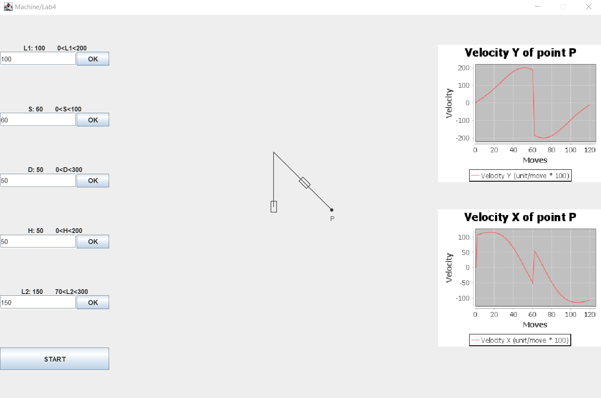
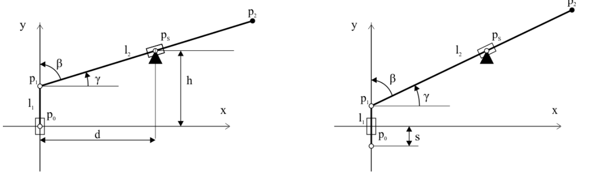

# Lab4-Machine
Project for laboratory Języki Programowania

Podczas laboratorium należy zbudować aplikację o przyjaznym, graficznym interfejsie użytkownika. Interfejs ten powstać ma w oparciu o klasy SWING lub klasy JavaFX (opcjonalnie).
Budowana aplikacja służyć ma do wizualizacji działania prostej maszyny jak na załączonym rysunku.

